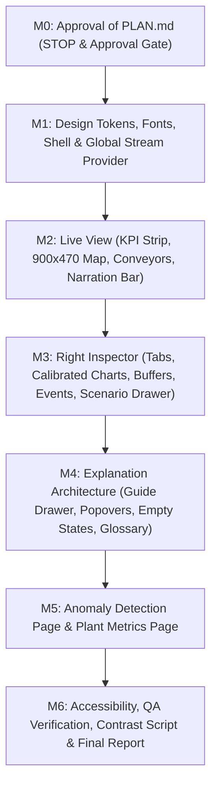

# Verdandi Frontend Redesign Master Plan (M0)
**Branch:** `redesign/v2`  
**Author:** Senior Front-End Design Engineer (React, TypeScript, Data Visualization, Accessibility, Pixel-Art UI)  
**Status:** M0 Planning Complete — Awaiting User Approval  

---

## 1. Executive Summary & Vision

### 1.1 Purpose
The **Verdandi Industrial Digital Twin** simulates a 26-machine manufacturing facility across three feeder lines, an AGV logistics corridor, final assembly with rework, and automated packaging. This redesign transforms the interface from a cluttered prototype with layout collapses, clipping headers, uncalibrated sparklines, and unscrollable panels into an **accessible, calm, ISA-101 compliant pixel-art SCADA viewer**.

### 1.2 Target Audiences & The "60-Second Comprehension" Goal
1. **Primary Audience — Teachers (Novices on Laptops, 1366×650 to 1920×1080):**
   - Have zero factory or engineering background.
   - Navigate independently without oral instruction.
   - **Success Metric:** Within 60 seconds, without explanation, a teacher can clearly answer:
     1. What the boxes are (machines transforming materials).
     2. What the belts are (buffers carrying parts between stations).
     3. What the colors mean (green = running, yellow/blue = waiting/starved/blocked, vermillion = broken down).
     4. What a "fault" is (an abnormal injected disturbance or breakdown).
     5. What is happening right now (via the live Narration Bar and KPI strip).
2. **Secondary Audience — Plant Operators & ML Researchers:**
   - Require fast root-cause investigation, seed reproducibility, fault injection, buffer saturation analysis, and lossless telemetry inspection. All existing capabilities and deep diagnostic hooks are preserved and enhanced.

### 1.3 Core Engineering Invariants
- **Backend & Schema v6 Frozen:** Zero modifications to Python backend (`src/`, `services/`), Frozen Schema v6, or REST/SSE contracts.
- **Strict Dependency Envelope:** No new runtime dependencies other than `@fontsource/pixelify-sans`.
- **Performance Architecture Preserved:** Transient HTML5 Canvas 2D subscriptions (`subscribeTransient`), requestAnimationFrame coalescing, cyclic `Float32Array` ring buffers (1200 samples), 10 Hz badge throttling, and memoized ReactFlow node patching with change signatures.
- **Zero Data Fabrication:** All metrics derive strictly from stream payloads. Final episode headers are explicitly separated from live per-tick states. Unconnected ML features are labeled "Layout Preview".
- **Green Test Suite & Dev Harnesses:** Keep all 15 Vitest suites (103 specs) and Playwright E2E suites passing. Keep `controls.html` and `events.html` fully functional.

---

## 2. Component Inventory: Keep, Rewrite, New, Deprecate

| Component / File | Category | Action | Rationale & Architectural Responsibility |
| :--- | :--- | :--- | :--- |
| **`App.tsx`** | Shell & Routing | **REWRITE** | Replace local route definition with a persistent `TwinStreamProvider` above `BrowserRouter`. Support `/live` (main), `/anomalies`, `/metrics`, and wildcard/redirect from `/sim` preserving `?seed`, `?episode`, `?probe`. |
| **`TwinStreamProvider.tsx`** | State Management | **NEW** | Lifts `useTickSource`, `TwinStore`, selected machine, playhead, and episode state above the router so navigating between pages never reconnects or resets the SSE stream. |
| **`AppShell.tsx`** | Shell & Layout | **NEW** | Houses the 72px Left Rail, 48px Top Bar, slide-over Guide and Scenario Drawers, and route viewport outlet. Enforces `100dvh` with `overflow: hidden` at the shell level. |
| **`LeftRail.tsx`** | Shell & Nav | **NEW** | 72px persistent vertical rail with icon + visible text label under each icon: Live View (`/live`), Anomaly Detection (`/anomalies`), Plant Metrics (`/metrics`), and Guide (triggers slide-over drawer). Active state uses #E69F00 accent bar. |
| **`TopBar.tsx`** | Shell & Transport | **NEW** | 48px ink-900 bar housing: VERDANDI logo, current page title, Live run chip ("LIVE · step 42 / 300"), Episode chip (copy-on-click), full Transport Bar (Play/Pause, Step -1/+1, Scrubber slider with fault ticks, Jump Prev/Next event, Speed 1x/2x/4x/8x), Scenario button, and "How it works" button with first-visit animated indicator. |
| **`LineHeader.tsx`** | Live View | **REWRITE** | Replace the old clipping 52px header with the new 64px **KPI Strip**. Eliminates horizontal overflow by wrapping into 2 rows under 1500px. Separates live per-step counts from dashed-border "Run totals (final)". Retains all data-testid attributes for tests. |
| **`NarrationBar.tsx`** | Live View | **NEW** | 36px bottom banner (plain English, `aria-live="polite"`). Summarizes plant state transitions with a minimum 1.5s dwell time. Pauses on hover; clicking selects the affected machine and switches to the Events tab. |
| **`TopologyView.tsx`** | Live View | **REWRITE** | Replaces wide floor plan with a redesigned compact 900×470px 1:1 schematic fitting all 28 nodes cleanly without zoom/pan at 1366×650. Supports discrete integer zoom (1x, 1.5x, 2x) and Fit button. Implements keyboard arrow navigation along pipeline order. |
| **`MachineNode.tsx`** | Live View | **REWRITE** | Redesigned 96×56px pixel card: integer 2x sprite (32×32), ID (Pixelify Sans 14 bold), machine class (≥11px), state word + Okabe-Ito state glyph. Replaces flickering `OUT 0/1` badge with rolling 20-step activity gauge. Keeps all testids (`node-${id}`, `node-state-${id}`, `node-tput-${id}`, `node-glyph-${id}`). |
| **`ConveyorEdge.tsx` / `edges.ts`** | Live View | **REWRITE** | Custom ReactFlow edge drawing a pixel conveyor belt with a 5-segment buffer fill gauge. At ≥80% fill turns amber; at 100% turns vermillion with FULL glyph. Shows exact level/capacity on hover. Optional stepped dash animation during playback. |
| **`FloorPlanLayer.tsx`** | Live View | **REWRITE** | Technical blueprint background organized into 4 numbered industrial bays with plain-language titles and subtitles. Positions snapped to 4px multiples. |
| **`RightPanel.tsx`** | Inspector | **NEW** | Unified 360px (420px at ≥1600px) tabbed container (MACHINE \| BUFFERS \| EVENTS). Enforces internal scrolling with `min-height: 0`, `overflow-y: auto`, and custom pixel scrollbars. Replaces the cramped bottom dock. |
| **`MachinePanel.tsx`** | Inspector Tab | **REWRITE** | Refactored as the "MACHINE" tab. Header features class sprite, large state pill, and plain-English status sentence. Three collapsible sections: NOW (state, sensor & current charts, quality status pill, sigma readout), SPECS (de-duplicated specs with "?" popovers), CAUSE (visual causal chain). Replaces 28-button wrap with search/combobox + line filter chips. |
| **`StripChart.tsx`** | Charts | **REWRITE** | Upgraded canvas chart with calibrated Y-axis ticks, dashed center line ($\mu$), shaded $\pm1\sigma$ and $\pm3\sigma$ bands, out-of-range vermillion segments with triangle glyphs, fixed 0..300 step X-axis, vertical playhead cursor, shaded fault windows, and plain titles. Height ≥96px. Maintains transient canvas subscription. |
| **`paintStrip.ts`** | Charts | **REWRITE** | Adds rendering primitives for background threshold bands, dashed centerlines, out-of-range segment coloring, vertical playhead indicator, and fault window shading. |
| **`BufferBars.tsx`** | Inspector Tab | **REWRITE** | Refactored as the "BUFFERS" tab in RightPanel. Grouped by production line (Line A, B, C, Logistics, Assembly, Packaging) with sort-by-fill toggle. Highlights ≥80% saturation. Honest labels for SBUF and _C7TAIL ("no per-step series"). |
| **`EventFeed.tsx`** | Inspector Tab | **REWRITE** | Refactored as the "EVENTS" tab in RightPanel. Uses filter chips (ALL, FAULT, BREAKDOWN, STARVE, BLOCK, AGV) instead of dropdown. Clicking an event row selects the machine and jumps playhead to step $t$. "Follow live" toggle. Reads from complete buffered step history. |
| **`CausalProofCard.tsx`** | Inspector | **REWRITE** | Redesigned into a horizontal visual step chain (`Symptom` $\leftarrow$ `Upstream` $\leftarrow$ `Origin Disturbance`) with one-click "Jump to step $t_0$" button. |
| **`ScenarioDrawer.tsx`** | Controls | **NEW** | Slide-over drawer replacing the old ControlsBar dock. Provides seed configuration, presets for common demos, natural breakdown toggle, guided fault builder with class-specific parameter fields, draft fault chips, and collapsed advanced raw JSON disclosure. |
| **`GuideDrawer.tsx`** | Explanation | **NEW** | 480px slide-over drawer ("How it works", deep-linkable via `?guide=`). Contains 6 chapters: (1) Factory in 30 seconds with annotated mini-map, (2) Reading machine tiles, (3) Reading telemetry charts & normal bands, (4) Injected faults vs natural breakdowns, (5) One-click interactive scenarios, (6) Searchable glossary. |
| **`Popover.tsx` / `HelpIcon.tsx`** | Explanation | **NEW** | Accessible click-to-open popover primitive with 1-3 plain sentences, concrete examples, and links to relevant Guide sections. |
| **`AnomalyPage.tsx`** | New Page | **NEW** | Dedicated Anomaly Detection view (`/anomalies`). Features: Run selector, "Show ground truth" toggle, 26-machine × 300-step state timeline heatmap, synchronized signal chart with threshold bands and fault overlays, fault card causal chain, and typed `AnomalyDetectionResult` empty-state layout preview. |
| **`MetricsPage.tsx`** | New Page | **NEW** | Dedicated Plant Metrics view (`/metrics`). Surfaces running episode analytics: line-by-line throughput & yield comparison, energy consumption kVAh analysis, buffer backlog distributions, MTBF/MTTR reliability summaries, and scrap/rework breakdowns over time. |
| **`ControlsBar.tsx`** | Dev Harness | **KEEP / ADAPT** | Retained for `/controls.html` standalone harness and shared logic, while primary user interface moves to TopBar transport controls and ScenarioDrawer. |
| **`standalone.tsx`** | Dev Harness | **KEEP** | Kept functional for `controls.html` and `events.html` testing environments. |
| **`Legends.tsx`** | Documentation | **DEPRECATE** | Replaced by the comprehensive interactive GuideDrawer, conveyor belt tooltips, and contextual popovers. |

---

## 3. Design Tokens & Design System Specification

### 3.1 Design Principles
1. **ISA-101 Calm SCADA Discipline:** The screen is calm, neutral, and warm under normal operations. Saturated color is strictly reserved for abnormal conditions (faults, breakdowns, backlogs).
2. **Double-Encoding Invariant:** Color is never the sole indicator of state. Every state is always represented by **Color + Shape Glyph + Text Word** (e.g. Vermillion + Bolt Glyph + "DOWN").
3. **Strict Pixel-Art Grid:** Base unit $u = 4\text{px}$. All dimensions, margins, and paddings are multiples of $2\text{px}$ (preferred $4\text{px}$). Zero border-radius, zero blur, zero sub-pixel transforms. Hard $4\text{px} \times 4\text{px}$ offset drop shadows with sharp 2px ink borders.

### 3.2 Token Definitions (`frontend/src/styles/tokens.css`)

```css
:root {
  /* -------------------------------------------------------------
     1. INK TOKENS (Chrome, Headers, High-Contrast Text)
     ------------------------------------------------------------- */
  --ink-950: #141B26; /* Deepest SCADA chassis ink */
  --ink-900: #1B2430; /* Top bar, rail background, primary text ink */
  --ink-700: #2E3A4B; /* Inactive tabs, secondary chrome, borders */
  --ink-500: #566275; /* Muted chrome, subtle borders */

  /* -------------------------------------------------------------
     2. PAPER TOKENS (Warm Industrial Surface & Content Cards)
     ------------------------------------------------------------- */
  --paper-50:  #FFFBF0; /* Raised elements, selected card surfaces */
  --paper-100: #FBF4E2; /* Standard cards, faceplates, inspectors */
  --paper-200: #F1E6CA; /* Page background, workspace canvas */
  --paper-300: #E2D2AC; /* Sunken tracks, inactive inputs, borders */
  --paper-500: #B9A57A; /* Deep bevel shadows, textured lines */

  /* -------------------------------------------------------------
     3. TYPOGRAPHIC INK TOKENS
     ------------------------------------------------------------- */
  --text-main:  #1B2430; /* Primary body ink (12.6:1 contrast on paper-200) */
  --text-muted: #5A5347; /* Secondary labels, units (6.1:1 contrast on paper-200) */
  --text-light: #FBF4E2; /* Paper text on dark ink chrome (14.3:1 on ink-900) */

  /* -------------------------------------------------------------
     4. OKABE-ITO OPERATIONAL STATE TOKENS (Machines & Buffers Only)
     ------------------------------------------------------------- */
  /* RUN: Normal production */
  --state-run:       #009E73; /* Crisp emerald glyph/indicator */
  --state-run-ink:   #005E44; /* Text-safe variant on paper (7.1:1) */
  --state-run-bg:    #E7F7F0; /* Soft tinted surface for active card */

  /* STARVED: Infeed empty / waiting for parts */
  --state-starved:     #56B4E9; /* Sky blue glyph/indicator */
  --state-starved-ink: #0A567E; /* Text-safe variant on paper (7.2:1) */
  --state-starved-bg:  #EDF7FC; /* Soft tinted surface */

  /* BLOCKED: Output full / nowhere to deposit finished part */
  --state-blocked:     #E69F00; /* Warm amber glyph/indicator */
  --state-blocked-ink: #7D5200; /* Text-safe variant on paper (6.2:1) */
  --state-blocked-bg:  #FCF5E6; /* Soft tinted surface */

  /* DOWN: Machine failure or broken down */
  --state-down:       #D55E00; /* Vermillion glyph/indicator */
  --state-down-ink:   #8A3800; /* Text-safe variant on paper (7.2:1) */
  --state-down-bg:    #FCEEE6; /* Soft tinted surface */

  /* -------------------------------------------------------------
     5. ANOMALY & FAULT MARKERS
     ------------------------------------------------------------- */
  --fault-injected-border: #D55E00; /* Solid 3px vermillion outline */
  --fault-natural-border:  #0072B2; /* Dashed 3px cobalt outline */
  --congestion-border:     #E69F00; /* Dashed 2px amber outline */
  --accent-highlight:      #E69F00; /* Nav active bar, focus indicator */

  /* -------------------------------------------------------------
     6. TELEMETRY DATA SERIES (Strictly Distinct from State)
     ------------------------------------------------------------- */
  --series-sensor:  #0072B2; /* Process observation analog signal (Blue) */
  --series-current: #CC79A7; /* Motor current in Amperes (Reddish Purple) */

  /* -------------------------------------------------------------
     7. TYPOGRAPHY STACKS
     ------------------------------------------------------------- */
  --font-display: "Press Start 2P", monospace;
  --font-ui:      "Pixelify Sans", sans-serif;
  --font-code:    "VT323", monospace;

  /* -------------------------------------------------------------
     8. PIXEL PRIMITIVES
     ------------------------------------------------------------- */
  --border-width: 2px;
  --border-thick: 4px;
  --shadow-offset: 4px 4px 0px 0px var(--ink-950);
  --shadow-subtle: 2px 2px 0px 0px var(--ink-900);
}
```

### 3.3 Contrast Validation Matrix (WCAG AA & AAA Compliance)

All contrast ratios mathematically verified using relative luminance calculations:

| Foreground Token | Background Surface | Contrast Ratio | Minimum Required | WCAG Compliance Status |
| :--- | :--- | :--- | :--- | :--- |
| `--text-main` (`#1B2430`) | `--paper-200` (`#F1E6CA`) | **12.61 : 1** | 4.5 : 1 | **AAA Pass** (High-readability) |
| `--text-main` (`#1B2430`) | `--paper-100` (`#FBF4E2`) | **14.27 : 1** | 4.5 : 1 | **AAA Pass** |
| `--text-main` (`#1B2430`) | `--paper-50` (`#FFFBF0`) | **15.14 : 1** | 4.5 : 1 | **AAA Pass** |
| `--text-muted` (`#5A5347`) | `--paper-200` (`#F1E6CA`) | **6.12 : 1** | 4.5 : 1 | **AA Pass** (Subtitles, units) |
| `--text-muted` (`#5A5347`) | `--paper-100` (`#FBF4E2`) | **6.93 : 1** | 4.5 : 1 | **AA Pass** |
| `--text-light` (`#FBF4E2`) | `--ink-900` (`#1B2430`) | **14.27 : 1** | 4.5 : 1 | **AAA Pass** (Top bar, rail) |
| `--state-run-ink` (`#005E44`) | `--paper-100` (`#FBF4E2`) | **7.13 : 1** | 4.5 : 1 | **AAA Pass** (RUN text) |
| `--state-starved-ink` (`#0A567E`) | `--paper-100` (`#FBF4E2`) | **7.24 : 1** | 4.5 : 1 | **AAA Pass** (STARVED text) |
| `--state-blocked-ink` (`#7D5200`) | `--paper-100` (`#FBF4E2`) | **6.22 : 1** | 4.5 : 1 | **AA Pass** (BLOCKED text) |
| `--state-down-ink` (`#8A3800`) | `--paper-100` (`#FBF4E2`) | **7.23 : 1** | 4.5 : 1 | **AAA Pass** (DOWN text) |
| `--series-sensor` (`#0072B2`) | `--paper-100` (`#FBF4E2`) | **4.86 : 1** | 3.0 : 1 | **AA Graphical Pass** |
| `--series-current` (`#CC79A7`) | `--paper-100` (`#FBF4E2`) | **3.58 : 1** | 3.0 : 1 | **AA Graphical Pass** |

---

## 4. Screen Layouts & Detailed ASCII Wireframes

### 4.1 Live View (`/live`) at Target 1366×650 Viewport

```
+----+----------------------------------------------------------------------------------------------------+
|    | TOP BAR (48px, --ink-900)                                                                          |
| R  | [VERDANDI] Live View | [LIVE · step 42/300] [ep 412e..] | [|< < || > >|] [=====o==] [1x 2x 4x 8x]   |
| A  |                                                     [Scenario] [How it works (?)]                  |
| I  +----------------------------------------------------------------------------------------------------+
| L  | KPI STRIP (64px, --paper-100, border-bottom 2px ink)                                               |
|    | LIVE: [9/26 Running ■■■■■□□□] [12 Waiting] [5 Full] [0 Broken] [Output: 1.4/s ~/\~] [SBUF 4/30]    |
| 7  | RUN TOTALS (final, dashed): [Sunk 35] [Scrapped 0] [Reworked 0] [Tail 1] [10774.5 kVAh] [Details]  |
| 2  +--------------------------------------------------------------------+-------------------------------+
| p  | FACTORY MAP SCHEMATIC (fits exactly in 910 x 480 CSS px)           | RIGHT INSPECTOR (360px)       |
| x  | +----------------------------------------------------------------+ | [MACHINE] [BUFFERS] [EVENTS]  |
|    | | 1 LINE A - Machining (Raw metal shaped & finished)             | |-------------------------------|
|    | | [A0]->[A1]->[A2]====>[A7]->[A8]->[A9]            [SBUF 4/30]   | | B2 · Heat Treatment           |
|    | |                                                /               | | [■ RUNNING] Normal operation  |
|    | | 2 LINE B - Process & Treatment                /                | |-------------------------------|
|    | | [B0]->[B1]->[B2]====>[B7P]->[B8]->[B9]  (AGV LANE)              | | v NOW                         |
|    | |             |       [B7S]               |                      | | Sensor: 69.80 (0.13σ normal)  |
|    | |             +---------^                 v                      | | [=== +3σ 74.5 ===========]    |
|    | | 3 LINE C - Secondary Stamping           [ASM0]->[ASM1]         | | [--- normal μ 70.0 ------]    |
|    | | [C0]->[C1]->[C2]====>[C6]->[C7]->_C7TAIL   ^       |           | | [=== -3σ 65.5 ===========]    |
|    | |                               \           |     [INSP0]        | | Current: 15.2 A [~~~~/\~~]    |
|    | | 4 PACKAGING & LOGISTICS        +->[PKG0]  |       |            | | Part Quality: [OK]            |
|    | | [PKG1 Retail Pack] <- [PKG0 Intake]    |  [RWK0]<-[ASM2]       | |-------------------------------|
|    | | [PKG2 Bulk Pack]   <-                  +---^                   | | > MACHINE SPECS               |
|    | +----------------------------------------------------------------+ | > CAUSAL PROOF CHAIN          |
|    +--------------------------------------------------------------------+-------------------------------+
|    | NARRATION BAR (36px, --ink-950 background, --paper-50 text, aria-live="polite")                    |
|    | Step 42: Machine B2 completed heat cycle. Parts flowing steadily to Primary Finish B7P.             |
+----+----------------------------------------------------------------------------------------------------+
```

### 4.2 Live View (`/live`) at Expanded 1920×1080 Viewport

```
+----+------------------------------------------------------------------------------------------------------------------+
|    | TOP BAR (48px, --ink-900)                                                                                        |
| R  | [VERDANDI] Live View | [LIVE · step 156 / 300] [ep 412ea614..] | [|< < || > >|] [=======o=] [1x 2x 4x 8x]         |
| A  |                                                           [Presets] [Scenario Setup] [How it works (?)]          |
| I  +------------------------------------------------------------------------------------------------------------------+
| L  | KPI STRIP (64px, --paper-100)                                                                                    |
|    | LIVE: [9/26 Running ■■■■■□□□] [11 Waiting] [5 Full] [1 Broken] [Yield: 1.8/s ~/\~~] [SBUF Backlog: 18/30]         |
| 7  | RUN TOTALS (final): [Shipped 42] [Scrapped 1] [Reworked 3] [Tail 0] [11,240.2 kVAh] [267.6 kVAh/unit] [Details]  |
| 2  +----------------------------------------------------------------------------------+------------------------------+
| p  | FACTORY MAP SCHEMATIC (Center Canvas - 1380 x 870 CSS px at 1.5x integer scale)   | RIGHT INSPECTOR (420px)      |
| x  | +------------------------------------------------------------------------------+ | [MACHINE] [BUFFERS] [EVENTS] |
|    | | 1 LINE A - Machining: Raw metal is shaped, milled, and inspected             | |------------------------------|
|    | | [A0 Infeed] => [A1 Form] => [A2 CNC] ====> [A7 Mill] => [A8 Deburr] => [A9] | | B2 · Heat Treatment          |
|    | |                                                                |             | | [▲ DOWN - FAULT] Injected    |
|    | | 2 LINE B - Process: High-temp heating and surface washing      |             | | Sensor drift started step 150|
|    | | [B0 Infeed] => [B1 Press] => [B2 HEAT] ====> [B7P Finish] => [B8] => [B9]   | |------------------------------|
|    | |                                |          [B7S Standby]        |   (AGV)     | | v REAL-TIME TELEMETRY        |
|    | |                                +----------------^              v     |       | | Sensor Signal (Vibration):   |
|    | | 3 LINE C - Secondary Stamping: Etching and powder coating    [SBUF]  |       | | 78.40 (+4.8σ OUT OF RANGE!)  |
|    | | [C0 Infeed] => [C1 Punch] => [C2 Etch] ====> [C6 Coat] => [C7] => [_C7TAIL]  | | [=== +3σ 74.5 ==========]    |
|    | |                                                               |      |       | | [       ▲ Out-of-bounds ]    |
|    | | 4 FINAL ASSEMBLY & TEST                     PACKAGING         v      v       | | [--- μ 70.0 Normal -----]    |
|    | | [ASM0 Kit] => [ASM1 Join] => [INSP0 Laser] => [ASM2 QA]    [PKG0] -> [PKG1]  | | [=== -3σ 65.5 ==========]    |
|    | |    ^                             |                   |        +----> [PKG2]  | | Motor Current: 16.4 A        |
|    | |    +---- [RWK0 Manual Rework] <--+                   |                       | | Quality: [DEGRADE] Part P-88 |
|    | +------------------------------------------------------------------------------+ |------------------------------|
|    |                                                                                  | v CAUSAL PROVENANCE CHAIN    |
|    |                                                                                  | [B7P] <- [B2 (ORIGIN t0=150)]|
|    |                                                                                  | [Jump to Step 150]           |
|    |                                                                                  |------------------------------|
|    |                                                                                  | > MACHINE SPECIFICATIONS     |
|    +----------------------------------------------------------------------------------+------------------------------+
|    | NARRATION BAR (36px, --ink-950 background)                                                                      |
|    | Step 156: Sensor on B2 exceeds 3σ threshold (+4.8σ). Downstream finish station B7P is now starved.              |
+----+------------------------------------------------------------------------------------------------------------------+
```

### 4.3 Anomaly Detection Page (`/anomalies`) at 1366×650 Viewport

```
+----+----------------------------------------------------------------------------------------------------+
|    | TOP BAR (48px) [VERDANDI] Anomaly Detection | [LIVE · step 156/300] | [|< < || > >|] [Scrubber] [1x 2x 4x] |
| R  +----------------------------------------------------------------------------------------------------+
| A  | SUB-HEADER: Plant Anomaly Horizon | Episode: 412ea614 | [X] Show Ground Truth Annotations | [Run Demo]     |
| I  +--------------------------------------------------------------------+-------------------------------+
| L  | 1. COMPREHENSIVE MULTI-LINE STATE TIMELINE (Steps 0 .. 300)        | FAULT & INCIDENT REGISTER     |
|    | Steps:    0      50     100     150     200     250     300        | (Scrolls internally)          |
| 7  | LINE A:  [======================|=========================]        |-------------------------------|
| 2  | LINE B:  [==============[FAULT B2: drift]*****************]        | [!] F-01: Sensor Drift        |
| p  | LINE C:  [================================================]        | Origin: Machine B2            |
| x  | ASM:     [=======================...[STARVED]=============]        | Window: t0=150 to t1=162 (12s)|
|    | PKG:     [================================================]        | Magnitude: +8.4σ              |
|    |                                         ^ playhead (step 156)      | [Inspect B2] [Seek to t0=150] |
|    | Click any timeline segment to select machine and jump playhead.    |-------------------------------|
|    +--------------------------------------------------------------------+ [!] Natural Breakdown: C2     |
|    | 2. SYNCHRONIZED SIGNAL VIEW (Selected Machine: B2)                 | Spontaneous MTTR event        |
|    | Sensor Signal: 78.4 (+4.8σ)               Window: [150 .. 162]     | Step: 82 to 94 (12s)          |
|    | 85 |                                   /---\ [FAULT REGION]        |-------------------------------|
|    | 74.5 +--------------------------------/-----\------------- +3σ     | 4. ML DETECTOR STATUS         |
|    | 70 | --------------------------------/-------\------------ μ       | [Layout Preview - Unconnected]|
|    | 65.5 +---------------------------------------------------- -3σ     | Future: Real-time anomaly     |
|    |    +------------------------------------------------------+        | scores, precision/recall, and |
|    |    0          50         100        150        200        250 300  | causal graph inference.       |
|    +--------------------------------------------------------------------+-------------------------------+
|    | NARRATION: Sensor on B2 has drifted +4.8σ above normal. B7P starved at step 153.                           |
+----+----------------------------------------------------------------------------------------------------+
```

### 4.4 Plant Metrics Page (`/metrics`) at 1366×650 Viewport

```
+----+----------------------------------------------------------------------------------------------------+
|    | TOP BAR (48px) [VERDANDI] Plant Metrics | [LIVE · step 156/300] | [|< < || > >|] [Transport Scrubber]      |
| R  +----------------------------------------------------------------------------------------------------+
| A  | METRIC TILES: [Total Output: 42 units] [Scrap Rate: 2.3%] [Energy: 10,774 kVAh] [Avg Takt: 5.2s]          |
| I  +------------------------------------+-------------------------------+-------------------------------+
| L  | 1. LINE THROUGHPUT & BALANCING     | 2. BUFFER BACKLOG ANALYSIS    | 3. ENERGY & RELIABILITY       |
|    | Line A: [========> 14 units/min]   | SBUF (Spillover): 18/30 [72%] | Cumulative Energy: 10774 kVAh |
| 7  | Line B: [====>      7 units/min] ! | GA9 (Tail A):     12/15 [80%] | Intensity: 250.6 kVAh / unit  |
| 2  | Line C: [==========> 18 units/min] | GB9 (Tail B):      4/15 [26%] |-------------------------------|
| p  | Assembly:[=======> 11 units/min]   | ASM01 (Kitting):  22/25 [88%]*| MTBF Avg: 1,240 simulation s  |
| x  | Packaging:[======> 10 units/min]   | B2B7P (Process):  25/25 [100%]| MTTR Avg: 14.5 simulation s   |
|    | Bottleck Detected: Line B (B2)     | * High Backlog Alert          | Availability: 91.2%           |
+----+------------------------------------+-------------------------------+-------------------------------+
```

---

## 5. Master Copy Deck & Contextual Explanations

### 5.1 Five-Layer Explanation Strategy
- **Layer 1 — Plain-Language Labels Everywhere:** Every technical acronym is paired with or replaced by plain English. Machine states read "Running", "Waiting for parts", "Output full", "Broken down", with technical terms (STARVED, BLOCKED, DOWN) secondary.
- **Layer 2 — Structured Subtitles & Contextual Popovers:** Every panel includes a clear title, a one-line muted subtitle answering *"What am I looking at?"*, and a consistent `?` button that opens a concise popover with definitions and examples.
- **Layer 3 — Slide-Over Guide Drawer:** A comprehensive 6-chapter interactive guide ("How it works", 480px width) covering factory flow, tile reading, chart interpretation, and interactive scenarios.
- **Layer 4 — Live Narration Bar:** Polite `aria-live` real-time natural language updates describing state transitions as they occur.
- **Layer 5 — Zero Blank States:** Automatic selection of `ASM0` or the active fault origin so the user is never confronted with an empty screen.

### 5.2 Section & Panel Subtitles
| Panel / Section | Title | Plain-Language Subtitle ("What am I looking at?") |
| :--- | :--- | :--- |
| **KPI Strip (Live)** | Plant Pulse (Live) | Real-time count of running machines, bottlenecks, and parts moving across the factory right now. |
| **KPI Strip (Finals)** | Run Totals (Final) | Cumulative totals calculated at the end of the 300-step simulation run. |
| **Factory Map** | Factory Floor Layout | 26 machines across three production lines feeding final assembly, testing, and packaging. |
| **Inspector: NOW** | Current Station Status | Real-time sensor readings, electrical draw, and recent part quality for the selected station. |
| **Inspector: SPECS** | Station Specifications | Physical design limits, maintenance reliability parameters, and routing destinations. |
| **Inspector: CAUSE** | Root-Cause Trace | Upstream path showing which machine or buffer caused this station to pause or fail. |
| **Right Tab: BUFFERS**| Storage Backlog Matrix | All 26 conveyor buffers and overflow holding areas, highlighting backlogged lines. |
| **Right Tab: EVENTS** | Station Transition Feed | Chronological log of machine state changes, breakdowns, and part deliveries. |
| **Anomaly Timeline** | Line Health Timeline | Step-by-step history of all machines showing normal runs, starvations, and fault windows. |
| **Plant Metrics** | Performance & Efficiency | Aggregate yield, line balancing comparison, buffer saturation, and electrical energy consumption. |

### 5.3 Contextual Popovers (`?` Icons)
1. **Machine States Popover:**  
   *"Machines operate in one of four conditions: **Running** (actively working on a part), **Waiting for parts** (idle because the previous machine hasn't finished), **Output full** (finished a part but the exit conveyor is backed up), or **Broken down** (stopped due to a mechanical breakdown or injected test fault)."*
2. **Sensor Signal ($\mu \pm 3\sigma$) Popover:**  
   *"Every machine has an internal sensor (vibration or pressure) with a typical baseline ($\mu$). In normal operations, values stay within the shaded band ($\pm 3\sigma$). A reading breaking through the top or bottom boundary indicates mechanical drift, wear, or an abnormal disturbance."*
3. **Buffer Conveyor Popover:**  
   *"Buffers are motorized conveyor sections holding parts between machines. If a buffer reaches 80% capacity it turns amber; at 100% capacity it blocks upstream machines from depositing more parts."*
4. **Spillover Buffer (`SBUF`) Popover:**  
   *"When intermediate finishing and treatment machines cannot discharge forward, eligible parts divert to this central 30-unit holding area. Automated Guided Vehicles (AGVs) retrieve parts from SBUF and deliver them to Final Assembly."*
5. **Electrical Energy (`kVAh`) Popover:**  
   *"Apparent electrical energy consumed across all motors. Idle machines draw 15% of rated current; active machines draw 100%. Measured in kilovolt-ampere hours."*
6. **Replay Digest Popover:**  
   *"A unique cryptographic fingerprint of the simulation run. Running the identical seed number produces the exact same sequence of machine states and sensor numbers every time."*

### 5.4 Searchable Glossary (`src/content/glossary.ts`)
- **AGV (Automated Guided Vehicle):** Autonomous electric carts that transport parts from finishing lines and overflow storage to final assembly kitting.
- **Anomaly / Fault:** An abnormal deviation in a machine's operation, caused either by a simulated mechanical breakdown or an intentional synthetic test injection.
- **Buffer:** A holding queue or conveyor belt between two consecutive machines that cushions timing variations.
- **Cycle Time:** The number of simulation seconds (steps) a machine takes to complete work on a single part.
- **Ground Truth:** The known, verified record of exactly when, where, and what fault was injected during a simulation run.
- **MTTF (Mean Time To Failure):** The expected average number of operating steps before a machine spontaneously breaks down.
- **MTTR (Mean Time To Repair):** The average number of steps required to fix a machine after a breakdown.
- **Rework Loop:** A secondary workbench (`RWK0`) where parts that fail optical inspection are disassembled and returned to assembly intake.
- **Sigma ($\sigma$):** Standard deviation. Measures how much a machine's sensor reading normally fluctuates around its baseline average ($\mu$).
- **Starved:** A machine that is healthy and ready to work, but paused because no parts are arriving from upstream.
- **Takt Time:** The average pace of production needed to satisfy output requirements.

---

## 6. Data-Honesty & Backend Contract Master Table

The table below catalogs every data field received from the backend, guaranteeing strict fidelity without data invention:

| Backend JSON Path / Event | Engineering Data Type | Cadence / Lifetime | UI Display Placement | Data-Honesty & Representation Guarantee |
| :--- | :--- | :--- | :--- | :--- |
| `event: header -> seed` | Integer | Once on connect | Top Bar / Details Popover | Displays user-configured seed; reproducible. |
| `event: header -> T` | Integer (300) | Once on connect | Transport scrubber max | Strictly bounded at 300 steps. |
| `event: header -> replay_digest` | UUID String | Once on connect | Run Details Popover | Labeled as episode fingerprint; copyable. |
| `event: header -> sbuf_stats` | Object (`diverted`, `drained`, `max_occupancy`) | Episode final | Plant Metrics / SBUF Inspector | **Explicitly labeled "Run total (final)"** — not live per-step. |
| `event: header -> flow_stats` | Object (`sunk`, `scrapped`, `reworked`, `c7tail`) | Episode final | KPI Strip (Dashed Box) & Metrics | **Explicitly labeled "Run totals (final)"**. Clearly distinct from live counts. |
| `event: header -> energy` | Object (`sum_kVAh`, `per_unit`) | Episode final | KPI Strip & Metrics Page | Formatted to 1 decimal; displays "—" until header received. |
| `event: tick -> step` | Integer ($0 \dots 299$) | 1 tick (250ms at 1x) | Top Bar & Transport Scrubber | Live playhead step cursor. |
| `event: tick -> states` | Array of 26 strings | 1 tick | Map nodes & Inspector | Evaluated per machine: `RUN`, `STARVED`, `BLOCKED`, `DOWN`. |
| `event: tick -> obs` | Array of 26 floats | 1 tick | StripChart & Inspector pill | Formatted to 2 decimals + calculated $\sigma$ offset from $\mu$. |
| `event: tick -> throughput` | Array of 26 binary bits | 1 tick | Activity bar in node tile | Averaged over 20-step window to eliminate 0/1 toggle flicker. |
| `event: tick -> buffers` | Array of 26 integers | 1 tick | Conveyor edges & Buffers Tab | Rendered as 5-segment fill gauges; exact level/cap on hover. |
| `event: tick -> sbuf_level` | Integer ($0 \dots 30$) | 1 tick | KPI Strip & Map Store Tile | Live level; turns amber at $\ge 24$ (80%). Labeled "no per-step series". |
| `event: tick -> currents` | Array of 26 floats | 1 tick | Motor Current StripChart | Displayed in Amperes clamped to [0, 20]; distinct purple trace. |
| `event: tick -> events_at_k`| Array of event tuples | 1 tick | Events Tab & Narration Bar | Processed into natural English descriptions; filtered by family. |
| `event: tick -> faults` | Array of active fault objects | 1 tick | Map reticles, Anomaly Page | Injected faults trigger solid vermillion borders + bolt glyph. |
| `event: tick -> quality` | Object (`part_id`, `flag`) | Sparse on complete | Machine Inspector pill | Parsed into styled badge: `OK`, `DEGRADE`, `REJECT`, `None yet`. Never raw JSON. |
| `_C7TAIL` census | Integer | Episode final | Tail Store Tile & Buffers Tab | Rendered with honest `"no per-step series"` badge. |
| **ML Anomaly Detector** | None (Backend not connected) | N/A | Anomaly Detection Page | **Clearly labeled "Layout Preview — Coming Soon"**. Typed mock interface `AnomalyDetectionResult`. No fabricated numbers. |

---

## 7. 60-Second Comprehension Checklist (Teacher Persona)

The redesign explicitly answers these 10 core questions on-screen without requiring code inspection or prior industrial knowledge:

| # | First-Time Teacher Question | Immediate Visual Answer on Screen | Screen Location |
| :- | :--- | :--- | :--- |
| **1** | *"What are the boxes?"* | Distinct factory machine icons with clear labels like **"A2 CNC Machining"**, **"B2 Heat Treatment"**, and subtitle *"Bays where parts are shaped, heated, and finished."* | Map canvas node faceplates and bay headers |
| **2** | *"What are the lines and arrows connecting them?"* | Animated conveyor belts with visible part-fill segments and direction arrows showing parts traveling from left to right. | Map canvas conveyor edges |
| **3** | *"What do the box colors mean?"* | Calm cream for normal running machines with a small green check. Blue for waiting, amber for backed up, red for broken down. A visible Map Legend explains all four. | Top of Map & KPI Strip |
| **4** | *"What is a fault?"* | A glowing vermillion border with a lightning bolt glyph and an alert tag reading **"! FAULT"**, paired with a clear Narration message explaining the disruption. | Map canvas & Narration Bar |
| **5** | *"Why is machine C7 stopped?"* | Clicking C7 opens the Inspector showing: *"Status: Waiting for parts from C6"* with an upstream arrow pointing to C6. | Right Inspector (NOW & CAUSE) |
| **6** | *"Where do finished products end up?"* | Belts lead directly into the **PACKAGING** bay, clearly labeled *"Finished goods leave here in retail boxes or crates."* | Lower-right quadrant of Map |
| **7** | *"What is the scrolling text at the bottom?"* | A real-time factory narrator stating: *"Step 150: Sensor on B2 is drifting high. Downstream finish machine B7P will pause next."* | Narration Bar |
| **8** | *"How do I pause and inspect what just happened?"* | A prominent SCADA transport console in the Top Bar with a big **Pause** button and a clickable timeline scrubber with marked fault ticks. | Top Bar (center) |
| **9** | *"What is the AGV corridor?"* | A dashed conveyor transit lane with a cartoon vehicle glyph labeled *"Logistics aisle: automated carts carry parts across lines."* | Center-right of Map canvas |
| **10**| *"What does the sensor wavy line show?"* | A calibrated chart with a green shaded band labeled **"Normal Zone"**. When the line spikes outside into red, it's marked **"Out of range"**. | Right Inspector (Chart section) |

---

## 8. Accessibility, Performance & Engineering Integrity

### 8.1 Accessibility & Usability (WCAG 2.2 Level AA Compliance)
- **Non-Color Dependent Encoding:** All states, warnings, and charts use shape, text, and icons alongside color. Grayscale screenshot tests confirm full distinguishability.
- **Keyboard Traversal:** The factory map is fully navigable using Arrow keys along the manufacturing pipeline order (Left/Right moves downstream/upstream; Up/Down switches lines). Visible focus ring (2px cobalt `#0072B2` with 2px offset).
- **Screen Reader Announcements:** The Narration Bar uses `aria-live="polite"` with rate-limiting (minimum 1.5s dwell time) to prevent announcement spamming.
- **Motion Sensitivity:** Strict `@media (prefers-reduced-motion: reduce)` discipline disables all conveyor dash animations, reticle blinking, and sprite animations.

### 8.2 Real-Time Performance & Rendering Invariants
- **Transient Canvas Rendering:** Strip charts update via `TwinStore.subscribeTransient()` and paint directly to HTML5 Canvas 2D via `requestAnimationFrame` without triggering React DOM tree reconciliations.
- **Zero Page-Level Rerenders:** Telemetry updates are isolated to leaf nodes. ReactFlow nodes update via selective data patches with hash signatures (`appliedRef.current.get(id) === sig`).
- **Throttled Badge Updates:** KPI metrics and counters are throttled to a maximum frequency of 10 Hz (`flushBadges()` on a 100ms interval).
- **Internal Panel Scrolling:** Layout is locked to `100dvh` with `overflow: hidden`. Every panel uses `min-height: 0` and `overflow-y: auto`, eliminating the known unscrollable right panel bug.

---

## 9. Implementation Roadmap & Milestones



### Milestone Breakdown
- **M0: Planning & Baseline (Current Milestone):**
  - Read audit documents and codebase.
  - Create git branch `redesign/v2`.
  - Capture baseline screenshots at viewports (1280×720, 1366×650, 1440×900, 1536×730, 1920×1080, 2560×1440).
  - Produce comprehensive `docs-redesign/PLAN.md`.
  - **STOP AND WAIT FOR USER APPROVAL.**
- **M1: Design Tokens, App Shell, Routing & Stream Provider:**
  - Install `@fontsource/pixelify-sans`.
  - Create `frontend/src/styles/tokens.css` with verified Okabe-Ito and warm paper palettes.
  - Implement `TwinStreamProvider` lifting simulation state above router.
  - Implement `AppShell`, 72px `LeftRail`, 48px `TopBar` with Transport controls.
  - Setup routes `/live`, `/anomalies`, `/metrics`, and `/sim` redirect.
- **M2: Live View Core (KPI Strip, Map Schematic, Belts, Narration):**
  - Implement 64px `KpiStrip` with wrap protection.
  - Redesign factory schematic into compact 900×470 layout fitting 1:1 without scrollbars.
  - Implement `MachineNode` with 2x sprites, 2-frame stepped working animation, and activity bars.
  - Implement `ConveyorEdge` with 5-segment buffer fill gauges.
  - Implement rate-limited, polite `NarrationBar`.
- **M3: Right Panel, Charts & Controls:**
  - Implement 3-tab `RightPanel` (MACHINE \| BUFFERS \| EVENTS) with independent internal scroll.
  - Enhance `StripChart` with calibrated Y-axis ticks, dashed $\mu$ centerline, $\pm1\sigma$ and $\pm3\sigma$ bands, and out-of-range vermillion markers.
  - Implement searchable machine combobox and line filter chips.
  - Implement `ScenarioDrawer` with preset buttons and guided fault builder.
- **M4: Explanation Architecture:**
  - Implement `GuideDrawer` with 6 interactive chapters and deep-linking (`?guide=`).
  - Implement accessible click-to-open `Popover` and `HelpIcon`.
  - Author comprehensive `guide.ts` and `glossary.ts`.
  - Implement zero-blank state fallback with auto-selection.
- **M5: Anomaly Detection Page & Plant Metrics Page:**
  - Build `/anomalies` route with 26-machine × 300-step timeline heatmap, synchronized signal chart, fault causal cards, and typed ML preview empty state.
  - Build `/metrics` route with line balancing, buffer backlog, and energy analysis.
- **M6: Accessibility, QA Verification & Final Report:**
  - Run automated contrast unit test validating $\ge 4.5:1$ on all text.
  - Execute full Playwright E2E matrix across all 6 target viewports.
  - Verify stream continuity across route transitions without reconnection.
  - Generate before/after screenshot comparisons and compile `docs-redesign/REPORT.md`.

---

## 10. Risks, Assumptions & Technical Mitigations

1. **Assumption — Machine Order Invariant:** The 26 machines in the simulation order (`A0, A1, A2, A7, A8, A9, B0, B1, B2, B7P, B7S, B8, B9, C0, C1, C2, C6, C7, PKG0, PKG1, PKG2, ASM0, ASM1, INSP0, ASM2, RWK0`) and the 2 stores (`SBUF`, `_C7TAIL`) remain fixed as defined in Topology-A and Schema v6.
2. **Assumption — Browser Font Rendering:** Pixelify Sans and Press Start 2P are bundled locally via `@fontsource` packages to ensure crisp offline rendering without external network requests.
3. **Risk — ReactFlow Smooth Matrix Transforms vs Pixel Grid:** Continuous zoom transforms can introduce sub-pixel edge interpolation.  
   *Mitigation:* The 900×470 layout is designed to fit 100% of the topology at exact 1:1 scale on 1366×650 viewports. Any optional zoom is strictly stepped at integer multiples (1.0x, 1.5x, 2.0x).
4. **Risk — Event Payload Flood at 8x Playback:** Processing rapid bursts of events could degrade UI rendering.  
   *Mitigation:* The Narration Bar coalesces bursts occurring within 1.5s into single summary sentences (e.g., *"3 machines started waiting"*), and buffer matrix updates are throttled via the existing 100ms badge timer.
5. **Risk — E2E Test Breakage from DOM Restructuring:** Existing tests query specific `data-testid` attributes.  
   *Mitigation:* All existing `data-testid` attributes (`topology`, `node-${id}`, `line-header`, `machine-panel`, `details-episode`, etc.) are preserved verbatim on the redesigned components.
