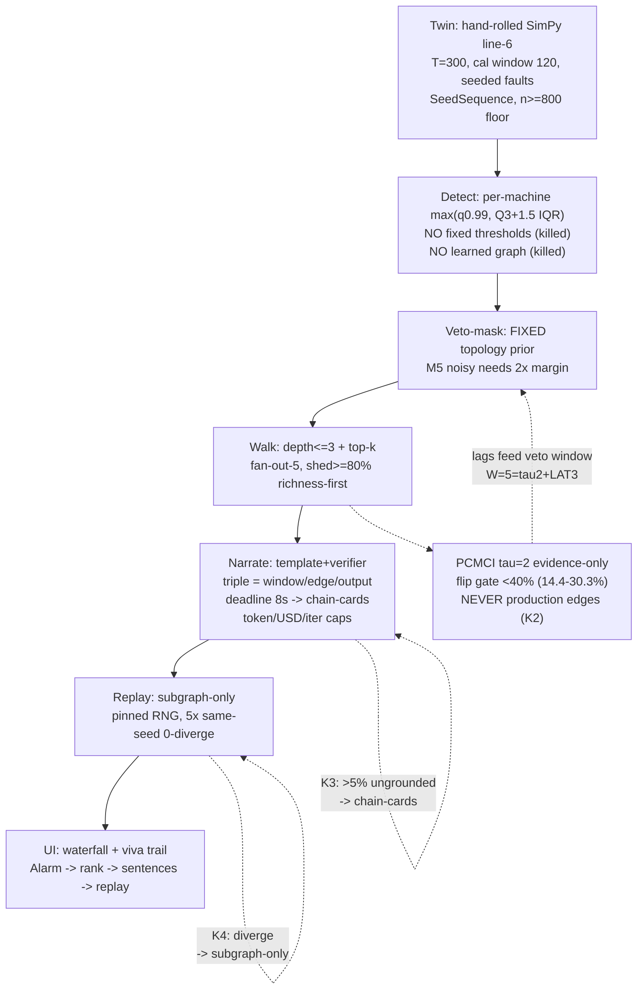
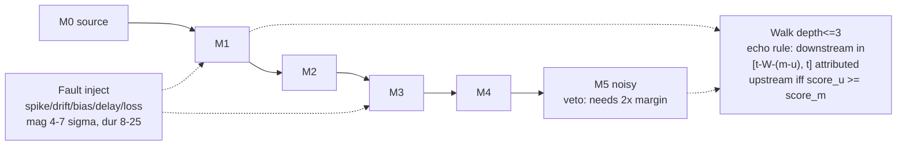
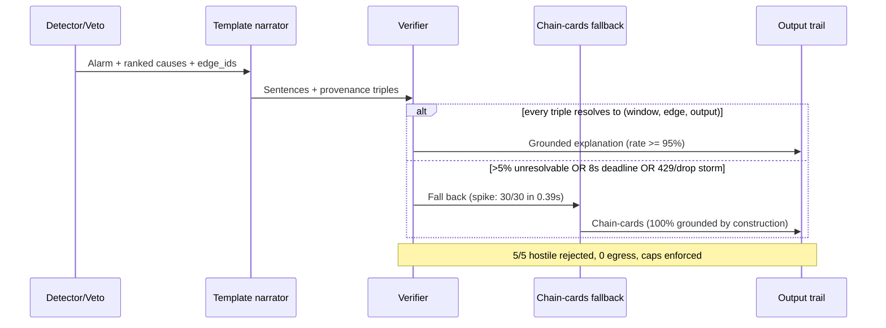
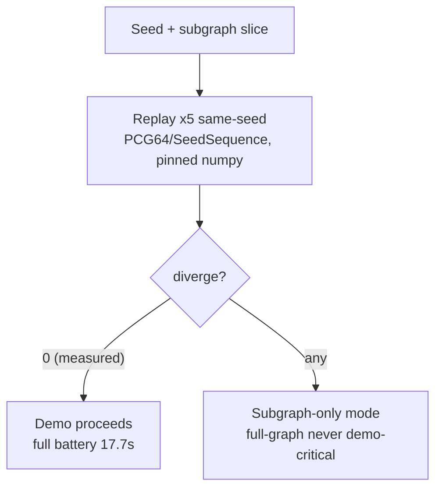
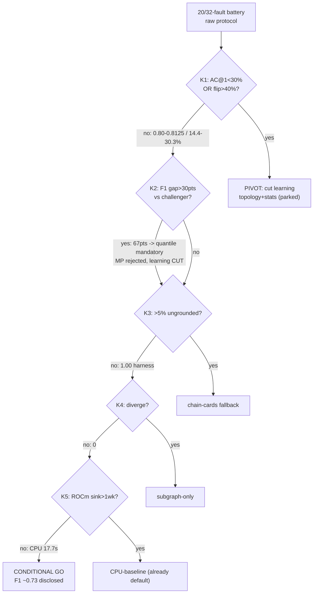
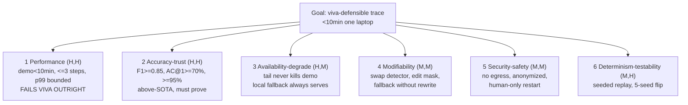
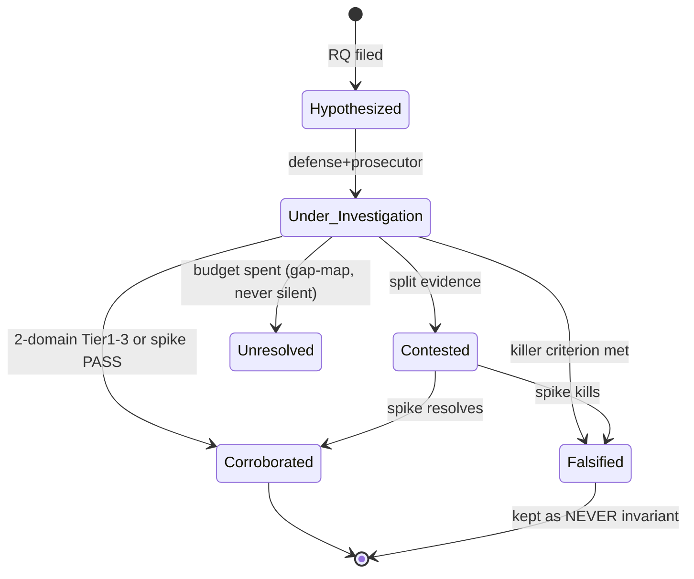
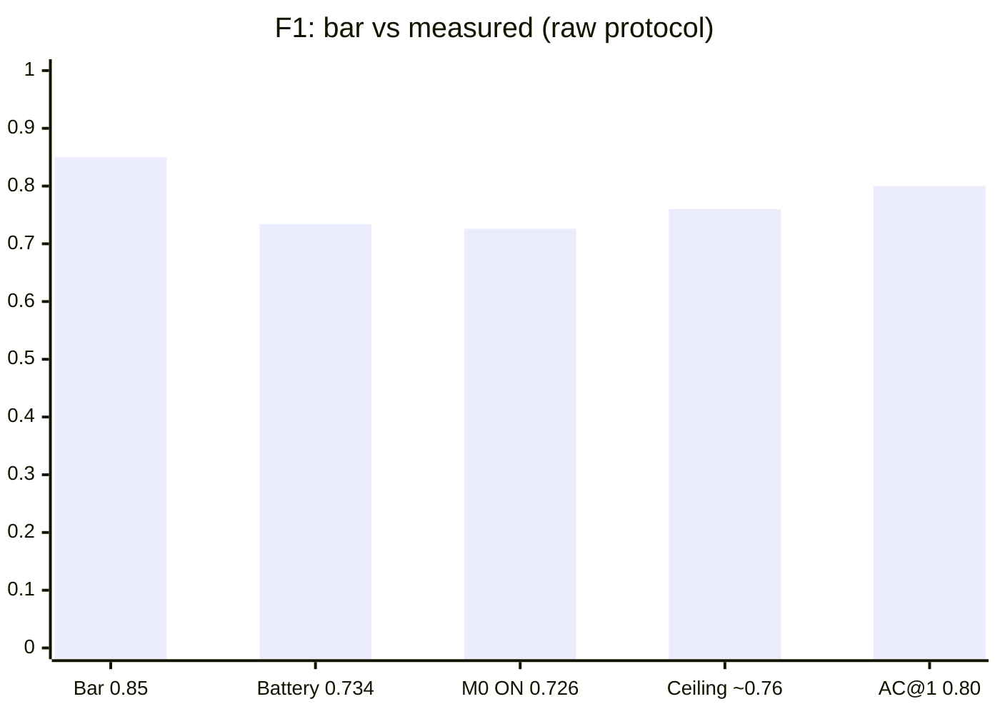
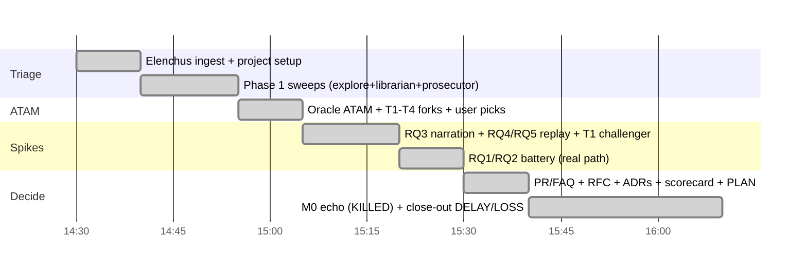
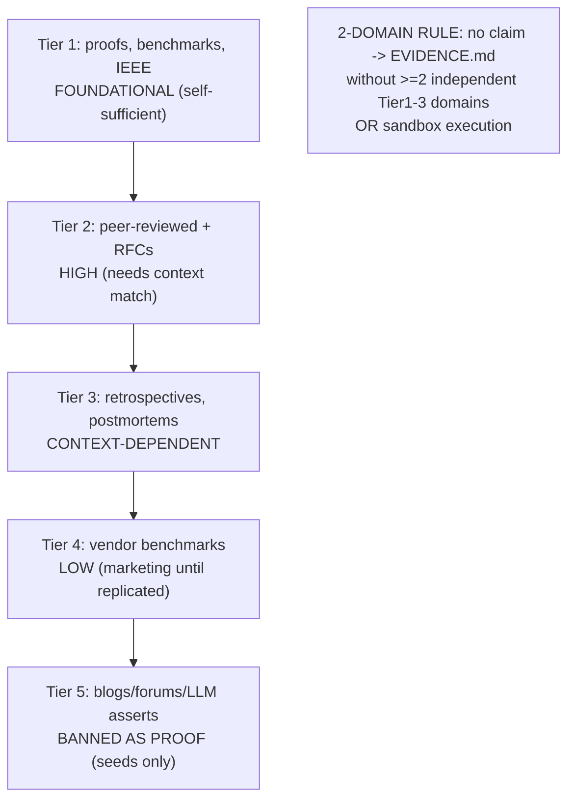

# DIAGRAMS — anomaly-twin-trace (Mermaid; text = truth, renders in GitHub/VSCode/docs)

> Conventions: numbers are measured (raw protocol) from `spike/REPORT_*.md`. Gates cite kill bars K1–K5.
> Decision records: `.opencode/blackboard/anomaly-twin-trace/DECISIONS.md` (ADR-0001–0012).

## 1. End-to-end pipeline (arch: `docs/ARCHITECTURE.md`, contracts: `docs/RFC.md`)

## 2. Twin topology + fault propagation (line-6; veto + walk overlaid)

## 3. Template+verifier narration (K3 gate; spike: `spike/rq3_spike.py`, 1.00 grounded)

## 4. Replay determinism (K4 gate; spike: `spike/spike_rq4_rq5.py`, 0-diverge 5x5)

## 5. Kill-gate decision tree (bars: README; battery: `spike/REPORT_BATTERY.md`)

## 6. ATAM utility tree (ranked business-value x risk; oracle: `WORKER` purged, filed in DECISIONS)

## 7. Claim lifecycle (Wieringa gate: truths are spiked, never voted)

## 8. F1 gap (measured; table fallback in `docs/SPIKES.md`)

Reading: attribution (M0: +0.034 P, zero recall cost) closes ~1/5 of the gap; principled ceiling
~0.76; residual = sensitivity on 3/20 missed faults (F-06/F-12/F-14) → M0b build item. Recall 0.912–0.934
stays strong throughout — ship posture CONDITIONAL with disclosed precision.

## 9. Crucible run timeline (single session 2026-09-11; memory: MESSAGES.md bus)

## 10. Evidence tiers + 2-domain rule (research: `docs/RESEARCH.md`)

## Diagram ↔ file index
| # | Diagram | Source of truth |
|---|---|---|
| 1 | Pipeline | `docs/ARCHITECTURE.md`, `docs/RFC.md` |
| 2 | Twin topology | `spike/battery_rq1_rq2.py`, `spike/closeout.py` |
| 3 | Verifier sequence | `spike/rq3_spike.py`, `spike/REPORT_RQ3.md` |
| 4 | Replay | `spike/spike_rq4_rq5.py`, `spike/REPORT.md` |
| 5 | Kill gates | `spike/REPORT_BATTERY.md`, `spike/REPORT_CLOSEOUT.md` |
| 6 | Utility tree | oracle ATAM (DECISIONS ADR-0003–0006) |
| 7 | Claim lifecycle | `PROTOCOL.md` §8 in blackboard memory |
| 8 | F1 gap | `spike/REPORT_M0.md`, `docs/SPIKES.md` |
| 9 | Timeline | blackboard `MESSAGES.md` bus |
| 10 | Tiers | `docs/RESEARCH.md` |
