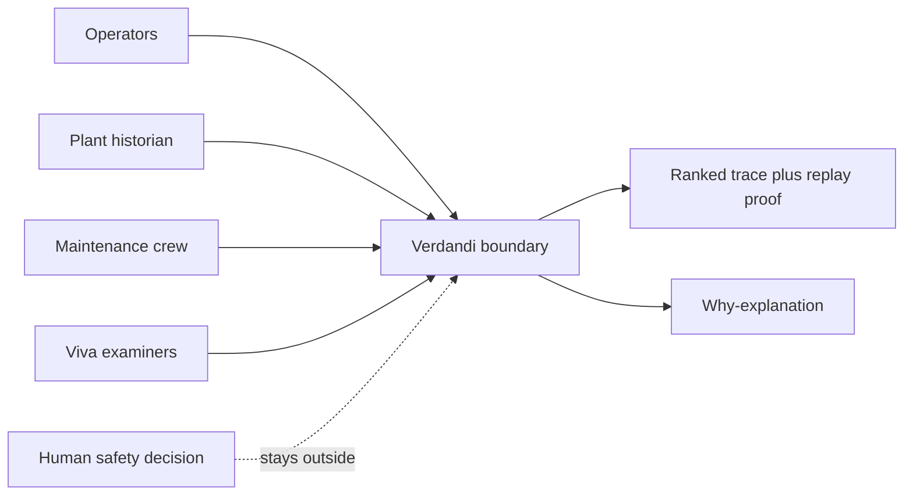
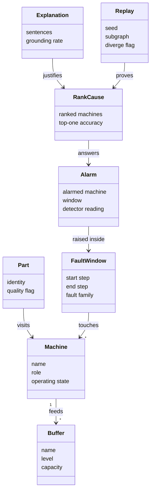
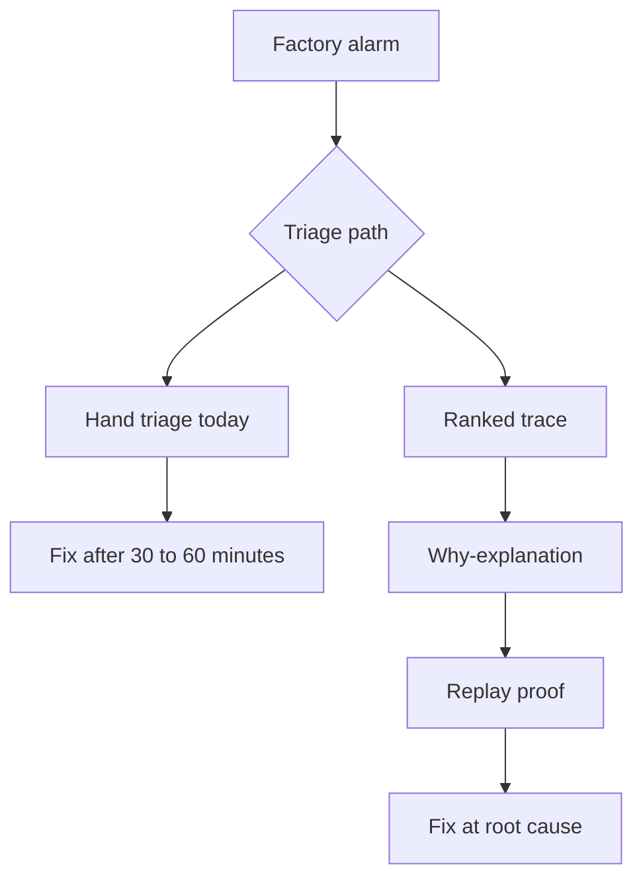
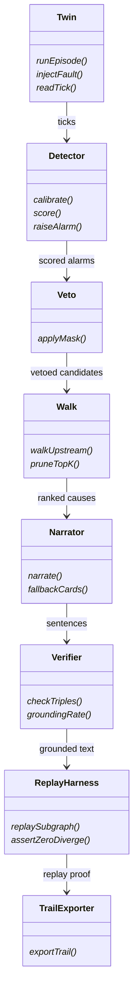
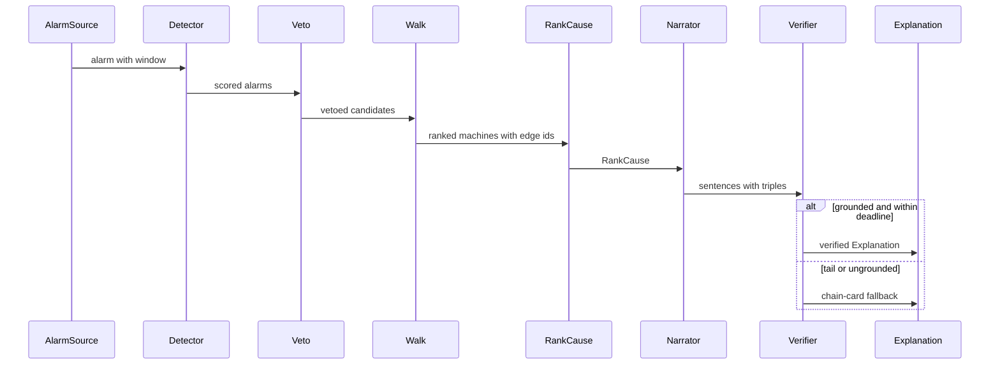
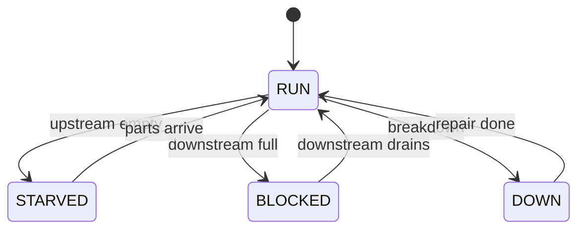
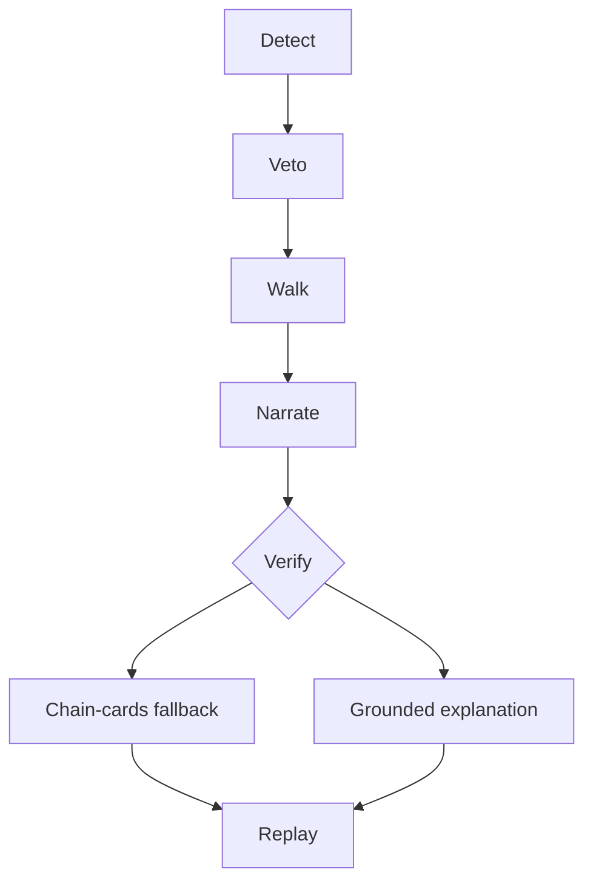
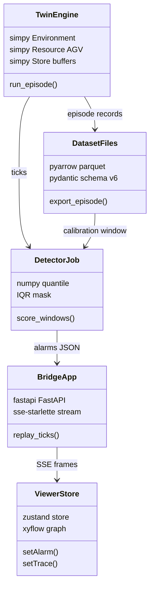
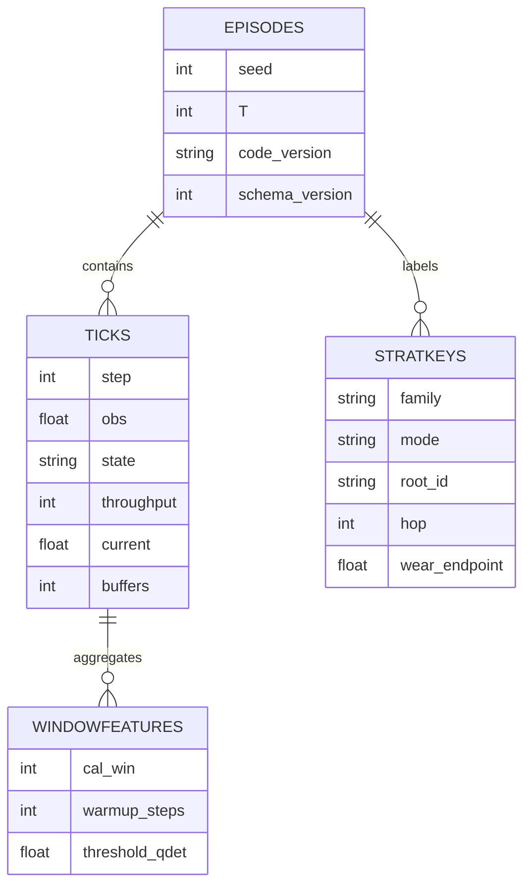
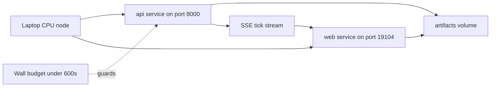

# MDA — Model-Driven Architecture for Verdandi

Three levels, computation-independent to platform-specific. Each level has an
intro, Mermaid diagrams, and a mapping back to repo files. Numbers are pinned
to `PLAN.md`, `docs/SIM_SPEC.md`, `docs/ARCHITECTURE.md`, and `src/config.py`;
nothing here invents metrics.

## 1. CIM (Computation-Independent Model)

The business problem, from `ELENCHUS_DISCOVERY.md`: a student team needs a
ranked causal trace plus a why-explanation for every factory-twin alarm,
because detectors alone force 30-60min of hand triage and unverifiable
stories lose viva marks. No software concepts appear at this level.

### 1.1 Context

Operators, the plant historian, the maintenance crew, and viva examiners
surround Verdandi. Alarms flow in, ranked traces with replay proof flow out.
The safety-restart decision stays human; the twin never issues clearance.

Maps to: `ELENCHUS_DISCOVERY.md` sections 1-2 (persona, stakeholders),
`docs/SIM_SPEC.md` section 13.2 (actuation boundary).

### 1.2 Domain model

Business entities only. No code types, no tables, no services.

Maps to: `docs/ARCHITECTURE.md` data contracts (`Alarm`, `RankCause`,
`Explanation`, `Replay`), `docs/SIM_SPEC.md` sections 2 and 5 (plant,
fault taxonomy).

### 1.3 Business process

Today an alarm means 30-60min of hand triage. With Verdandi it means a
ranked trace plus a why-explanation plus replay proof, straight away.

Maps to: `ELENCHUS_DISCOVERY.md` POV line and HMWs, `PLAN.md` verified goal.

## 2. PIM (Platform-Independent Model)

The design from `docs/SDD.md` and `docs/ARCHITECTURE.md`, with no platform
types: no Python, no TypeScript, no SimPy, no Parquet. Components expose
abstract operations; data shapes are logical, not serialized.

### 2.1 Structural view

Seven logical components. Abstract operations end with `*`.

Maps to: `docs/SDD.md` section 2.2 module specs, `docs/ARCHITECTURE.md`
pipeline (`Twin -> Detect -> Veto-mask -> Walk -> Narrate+Verify ->
Replay -> UI + trail`).

### 2.2 Interaction view

One alarm travelling the full chain, including the fallback branch.

Maps to: `docs/SDD.md` sequence diagram, `docs/ARCHITECTURE.md` narrate
step (8s deadline, K3 5% rule).

### 2.3 Behavioral view

Machine states plus the fallback chain as an activity flow.

Machine states map to `docs/SIM_SPEC.md` section 8 channel 5
(`RUN`, `BLOCKED`, `STARVED`, `DOWN`). The chain maps to
`docs/ARCHITECTURE.md` steps 2-7 and quality scenarios S2 (8s deadline)
and S4 (0-diverge).

## 3. PSM (Platform-Specific Model)

Concrete technology from the repo: SimPy twin, FastAPI SSE bridge, React
plus Zustand viewer, Parquet offline store. No SQL database exists. CPU-only.

### 3.1 Technical structural view

Maps to: `src/twin.py` and `src/config.py` (twin), `services/sim_bridge/app.py`
and `sse.py` (bridge), `frontend/` with `zustand` and `@xyflow/react`
(`frontend/package.json`), `src/dataset_export.py` (Parquet export).

### 3.2 Data model

Parquet files, not Postgres. One row per tick, one header per episode,
stratification keys per record.

Pins: `T=300`, `CAL_WIN=120`, `WARMUP_STEPS=15`, `TWIN_SCHEMA=6`,
`CODE_VERSION=twin-2.5.0-topology-A` (`src/config.py`); 26 machines and 26
buffers (topology-A roster); 182-row manifest is 26 machines x 7 fault
classes (`docs/SIM_SPEC.md`); tick keys frozen in
`services/sim_bridge/SCHEMA.md`. Channel 9 energy is header-only, channel
10 air is on probation (`docs/SIM_SPEC.md` section 8).

### 3.3 Deployment view

One laptop CPU node, two containers, one shared volume, SSE transport,
600s wall budget.

Maps to: `compose.yaml` (`api` + `web` services, `verdandi-artifacts`
volume), `.env` (`WEB_PORT=19104`, `API_PORT=8000`), `scripts/check_gates.py`
(`--max-s` default 600.0).

## 4. Mapping matrix

| Model Type | CIM | PIM | PSM |
|---|---|---|---|
| Context | Section 1.1 context diagram, `ELENCHUS_DISCOVERY.md` | Pipeline logical flow, `docs/SDD.md` | Section 3.3 deployment flowchart, `compose.yaml` |
| Structural | Section 1.2 domain model, business attributes only | Section 2.1 components with abstract operations | Section 3.1 SimPy, FastAPI, Zustand, Parquet types |
| Interaction | Section 1.3 alarm-to-proof process | Section 2.2 alarm chain sequence | SSE tick frames, `services/sim_bridge/SCHEMA.md` |
| Behavioral | 30-60min triage versus ranked trace | Section 2.3 machine states plus fallback chain | Wall budget and 0-diverge gates, `scripts/check_gates.py` |
