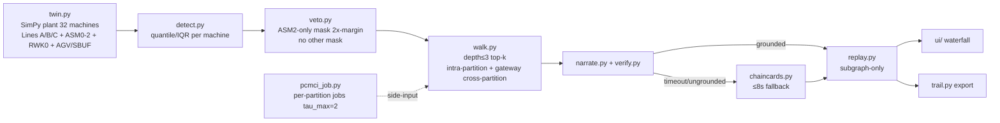
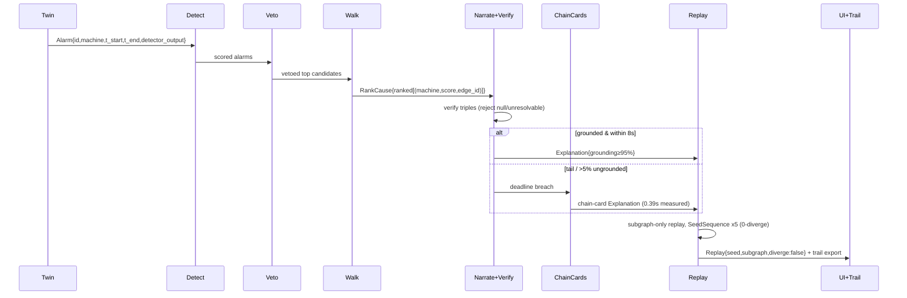
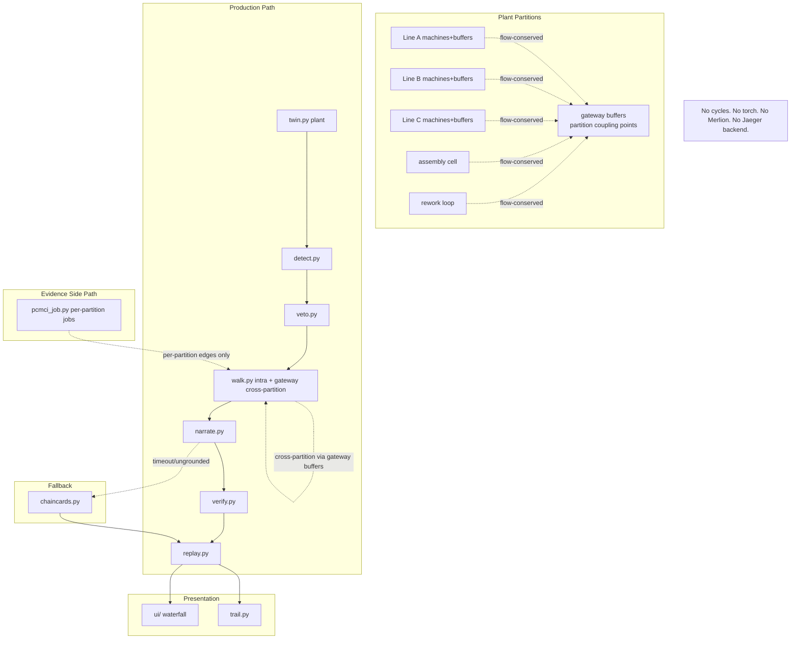

# SDD — anomaly-twin-trace (IEEE 1016-2009)

## 1. Identification + references + definitions

System: anomaly-twin-trace — ranked causal trace + why-explanation per factory-twin alarm, CPU-only laptop demo <10min. Plant decision (locked): 32 machines per SIM_SPEC — Lines A/B/C (10/10/8) + assembly cell ASM0–2 + rework RWK0, AGV pool + shared overflow buffer, mass-flow-conserved coupling, partitioned causal evidence (SIM_SPEC rewrite on disk; this SDD carries line-scale battery numbers as baselines pending plant-scale re-measurement). Refs: docs/RFC.md, docs/ARCHITECTURE.md, docs/TECHNICAL.md, ELENCHUS_DISCOVERY.md, spike/REPORT*.md, ADR-0012 (FactorySimPy 0.1.0b3 rejected: no trace/fault/RNG API → hand-rolled SimPy twin). Defs: AC@1=top-1 cause accuracy; triple=(fault-window, edge-id, detector-output); chain-cards=≤8s template fallback; K1–K5=regression gates; partition=line/cell evidence unit (Line-A/B/C, assembly-cell, rework-loop) with gateway buffers + AGV/SBUF at coupling points.

Pipeline: `Twin→Detect→Veto→Walk→Narrate+Verify→Replay→UI+Trail`. Contracts: `Alarm{id,machine,t_start,t_end,detector_output}`→`RankCause{alarm_id,ranked[(machine,score,edge_id)],AC@1}`→`Explanation{alarm_id,sentences[{text,triple|null}],grounding_rate}`→`Replay{alarm_id,seed,subgraph,diverge_bool}`; verifier rejects null/unresolvable triples.

Environment: Python 3.14.7, CPU-only, no torch/GPU. Pinned: simpy==4.1.2, tigramite==5.2.10.1 (evidence-only), networkx==3.6.1, numpy==2.4.6, psutil==7.2.2, scipy==1.18.1. stumpy==1.14.1 offline-validation only (killed as detector). Config constants imported from one table in TECHNICAL.md (CAL_WIN=120, Q_DET, VETO_ASM2, WALK_DEPTH≤3/TOPK, PCMCI ParCorr tau_max=2/pc_alpha=0.05/α=0.01, N_FLOOR=800, ECHO_W=5, NARR_DEADLINE≤8s, CAPS $0.005/2.5k tok/iter, SHED_AT 80%, SEED via SeedSequence). Never hardcode twice.







### 2.1 Context viewpoint
View: Boundary — full-plant SimPy twin (32 machines: Lines A/B/C 10/10/8 + assembly cell ASM0–2 + rework RWK0, mass-flow-conserved coupling via gateway buffers + AGV pool + shared overflow buffer, T=300/episode, cal-win 120) in; waterfall UI + viva-trail out. Actors: BTech team (viva), grader (replay). Out-of-scope: prod fleet, live stream, safety authority.
Rationale: Entire-plant batch-sim scope is the CPU-demonstratable claim (line-scale battery 17.7s carried as baseline; plant-scale wall re-measured at M0 exit, must hold <600s via partitioning); partial-plant sim would void cross-machine attribution and K-gates.

### 2.2 Composition viewpoint
View: `twin.py, detect.py, veto.py, walk.py, pcmci_job.py, narrate.py+verify.py, chaincards.py, replay.py, ui/, trail.py` (spike/ quarantined, rewrite-don't-merge). Cell/line partitioning: twin + detect + veto operate per machine but grouped by partition (Line A/B/C, assembly cell, rework loop); pcmci_job runs one evidence job per partition; walk runs intra-partition first, then cross-partition via gateway buffers. Reuse: twin←battery_rq1_rq2.py+closeout.py; detect←battery (Q_DET); veto←battery (VETO_ASM2, ex-VETO_M5, identical 2x-margin semantics, ASM2-only); walk←battery+m0_echo doc-note; pcmci_job←battery; narrate+verify←rq3_spike.py; chaincards←rq3_spike.py; replay←spike_rq4_rq5.py; ui←EvidencePanel.tsx:246+GraphView.tsx; trail←battery JSONL→SPEC schema.
Rationale: One module per pipeline stage isolates killed alternatives (GDN/MP/free-LLM) so K1/K2/K3 can cut a stage without redesign. Partitioning isolates evidence cost per cell/line so plant scale adds partitions, not a bigger single graph.

### 2.3 Logical viewpoint
View: Twin owns full-plant faults+truth partitioned by line/cell (every machine + flow edge injectable within its partition; classes spike/drift/bias/delay/loss/breakdown/quality per SIM_SPEC §5, mag 4–7σ, dur 8–25; free ground truth per fault; flow-conserved coupling at gateway buffers); Detect owns `max(q0.99,Q3+1.5·IQR)` per-machine; Veto owns one fixed mask only: VETO_ASM2 (ASM2-test noisy tail needs 2× margin over runner-up to keep top-1, otherwise demote to rank 2; no other mask); Walk owns depth≤3/top-k intra-partition plus one gateway hop exempt from depth for cross-partition (alarm partition first, then gateway buffer edges to neighbor partitions); PCMCI-evidence owns per-partition edges only; Narrate+Verify owns triples+caps.
Rationale: Static ownership enforces evidence-only causality (production edges never learned) and bans global fixed thresholds (killed: SWaT 0.886→0.281). Full-plant twin ownership guarantees no machine is unmodeled — root cause always resolves inside the simulated plant, via gateway buffers when it crosses partitions.

### 2.4 Dependency viewpoint
View: Layered DAG Twin→Detect→Veto→Walk→Narrate+Verify→Replay→UI; PCMCI-evidence runs as per-partition jobs side-inputting Walk only (one job per line/cell, never a full-plant graph); cross-partition walk resolves only through gateway-buffer edges; no cycles; no torch/GPU, no Merlion (archived), no Jaeger backend (pattern-copy only).
Rationale: DAG + side-only per-partition evidence prevents learned-graph detection (GSL ineffective) from leaking into production path (K2), and keeps evidence cost linear in partitions instead of quadratic in plant nodes.

### 2.5 Information viewpoint
View: JSONL traces: `trace_battery/m0/closeout/rq3.jsonl` + `traces/timing.json`; persisted faults, quantiles, per_fault[], vectors; N_FLOOR=800 for PCMCI windows.
Rationale: Single-record JSONL gives free ground truth and flip/lag-stability audit (flip<40%, lag-stab 0.889) without a DB.

### 2.6 Interface viewpoint
View: Internal JSON contracts Alarm→RankCause→Explanation→Replay (§1); external: waterfall props, viva-trail export (battery JSONL→trail: alarm_id, rank_cause, explanation, replay{seed,subgraph,diverge:false,runs:5}, evidence{F1/AC@1/flip/p99,spike_ids}).
Rationale: Narrow JSON contracts let verifier/fallback swap (template↔chain-cards) with zero caller change under ≤8s deadline.

### 2.7 Interaction viewpoint
View: S1 burst 20-fault (p99≤30s, AC@1≥70%); S2 tail→chain-cards ≤8s (30/30 in 0.39s); S3 malformed→100% reject, 0 egress; S4 same-seed×5→0-diverge (K4, SeedSequence, subgraph-only, whole-flow context preserved).
Rationale: Scenarios are the ATAM gates; each binds a numeric measure so viva demo degrades to fallback, never to ungrounded text.

### 2.8 Resource viewpoint
View: CPU-only laptop; PCMCI ParCorr tau_max=2, pc_alpha=0.05, α=0.01 per-partition job (tau=3 evidence-only, never production); WALK_DEPTH≤3/top-k (fan-out cap 8 for the assembly join per SIM_SPEC §7.3; line-scale fan-out-5 carried as baseline only, plant fan-out re-measured at M0 exit); caps $0.005/2.5k tok/iter; shed richness-first at ≥80% (never detection/provenance).
Rationale: Caps + shed bound the $47K-loop and OOM risks; tau-2 + depth≤3 hold line-scale cost (p99 2.6ms, battery 17.7s + closeout 3.1s baselines; tau=3 runs evidence-only in PCMCI jobs, never in walk/production). Plant scale: PCMCI complexity is O(P²×tau_max) per partition with P≈6–8 nodes, so total cost scales with partition count, not plant N. Full-plant PCMCI (N=32: 32²×2=2048+ tests per seed) is banned: it breaks the <600s CPU bar and the N_FLOOR=800 window per edge budget. Walk depth≤3 re-justified: intra-partition depth≤3 covers any line/cell, plus at most one gateway hop exempt from depth for cross-partition (alarm partition → gateway buffer → neighbor partition), so production depth stays ≤3 with the gateway hop not counted; fan-out cap is 8 (assembly join) with plant-scale re-measure at M0 exit because gateway buffers add one extra branching point per partition boundary.

Alternatives (RFC): Learned-GDN rejected (GSL ineffective, no torch); MP-discord rejected as detector (F1 0.063, AC@1 0.20, 1700× slower); free-LLM rejected (38.5% ungrounded + $47K-loop → template+verifier+caps+fallback).

## 4. Per-module detailed design

Reuse rule: spike/ stays quarantine. Build modules rewrite (don't merge) from the listed spike source. All RNG via SeedSequence, never bare default_rng(int). All thresholds via TECHNICAL.md constants.

### 4.1 twin.py (from spike/battery_rq1_rq2.py `run_episode`, `build_faults`; extended by spike/closeout.py DELAY/LOSS)
Responsibilities: Hand-rolled SimPy plant (32 machines: Lines A/B/C 10/10/8 + ASM0–2 + RWK0, T=300/episode, CLEAN=120 calibration window); per-machine params per SIM_SPEC Table 3.1 (cycle_steps, MTTF/MTTR geometric breakdown/repair, buffer caps); mass-flow-conserved coupling between partitions via gateway buffers + AGV pool (capacity 2, tail-to-ASM0 transfers, agv_steps uniform [4,8]) + shared overflow buffer SBUF (cap 30, class-gated divert, drains to ASM0 on free AGV); seeded fault injection (spike/drift/bias mag 4–7σ dur 8–25; DELAY lag-shifted propagation d≤tau; LOSS 10–30% drops median-imputed; BREAKDOWN forced DOWN for window MTTR×mult mult∈[1,3]; QUALITY ASM2/RWK-path reject-rate 15–40% for window); free ground truth; downstream propagation is flow-delayed within partition, gateway/AGV-delayed across partitions (line-scale 0.45^lag echo decay carried as baseline only, never implemented).

```python
def build_faults(seed: int = 12345) -> list[dict]: ...
def run_episode(seed: int, fault: dict) -> dict: ...  # returns episode record {obs[32][300], states[32][300], buffers[31][300], agv_waits, parts, faults} per SIM_SPEC §4.4, partition labels attached
def run_calibration(seed: int) -> np.ndarray: ...  # returns (CLEAN=120, 32) clean window
```

Inputs: seed int, fault {id, machine, t0, dur, mag, kind} with kind ∈ {spike, drift, bias, delay, loss, breakdown, quality} + extra {d | drop_rate | mttr_mult | reject_rate}. Outputs: episode dict {obs[32][300], states[32][300], buffers[31][300], agv_waits, parts, faults} + fault record persisted to JSONL.
Error paths: bad fault spec (machine out of range, t0+dur > T_EP) → ValueError, episode skipped, logged; RNG drift (numpy version mismatch vs pin 2.4.6) → assert + record version in trace; LOSS imputation failure (all-NaN window) → fall back to forward-fill then episode reject if still NaN.

### 4.2 detect.py (from spike/battery_rq1_rq2.py quantile/IQR block)
Responsibilities: Per-machine threshold `max(q0.99, Q3+1.5·IQR)` fit on CLEAN window only; raw point-wise scoring (point-adjusted inadmissible); emits Alarm records; DELAY mitigation tau≥d window; LOSS median-impute before scoring.

```python
def fit_thresholds(clean: np.ndarray) -> dict[int, float]: ...
def detect(trace: np.ndarray, thresholds: dict[int, float]) -> list[Alarm]: ...
```

Inputs: clean (CLEAN=120, 32), trace obs[32][300] from episode dict. Outputs: `Alarm{id,machine,t_start,t_end,detector_output}` list. Plant note: same per-machine rule applied to all 32 machines; partition id attached to each Alarm for per-partition gating.
Error paths: F1-drop>30pts vs baseline → K2 fires, quantile mandatory, kill MP/global-fixed path (per fallback matrix); empty detection on injected fault (F-06/F-12/F-14 M0b backlog) → log miss, keep episode, flag sensitivity backlog; NaN input → reject window, no alarm emitted.

### 4.3 veto.py (from spike/battery_rq1_rq2.py VETO block, renamed VETO_ASM2)
Responsibilities: Fixed topology prior only. ONE mask: VETO_ASM2 — ASM2-test (known-noisy σ=2.0) needs 2× margin over runner-up to keep top-1; otherwise demote ASM2 to rank 2. No other mask. No learning, no adaptive mask. Evaluated per partition.

```python
def apply_veto(scored: list[tuple[int, float]]) -> list[tuple[int, float]]: ...
```

Inputs: scored [(machine, score)]. Outputs: re-ranked list, same type.
Error paths: margin exactly 2× boundary → keep ASM2 (tie favors incumbent top); empty/singleton input → passthrough; misconfigured VETO_ASM2 id → ImportError-fast at startup, never silent skip.

### 4.4 walk.py (from spike/battery_rq1_rq2.py depth≤3 walk + spike/m0_echo.py ECHO_W=5 doc-note)
Responsibilities: Upstream attribution walk depth≤3 with top-k prune (fan-out cap 8 for the assembly join per SIM_SPEC §7.3; line-scale fan-out-5 carried as baseline only, plant fan-out re-measured at M0 exit); intra-partition walk first, then one gateway hop exempt from depth for cross-partition (alarm partition edges → gateway buffer → neighbor partition edges); echo suppression documented (downstream alarm within ECHO_W=tau2+LAT_GATE=5 attributed upstream); Kingman shed at queue util ≥80% richness-first, never detection/provenance; produces RankCause.

```python
def walk(alarm: Alarm, edges: dict[int, list[int]], scores: dict[int, float], depth: int = 3, topk: int = 8) -> RankCause: ...
def subgraph(alarm_node: int, edges: dict[int, list[int]], depth: int = 3) -> list[int]: ...
```

Inputs: Alarm, topology edges, per-machine scores. Outputs: `RankCause{alarm_id, ranked[(machine,score,edge_id)]}` with partition + gateway-hop flags.
Error paths: depth>3 requested (single gateway hop exempt, not counted) → AssertionError (OOM guard); 10× surge → shed richness first, walk result still served; flip>40%/AC@1<30% evaluated per partition → K1 fires for that partition, cut learned edges there, topology+stats only.

### 4.5 pcmci_job.py (from spike/battery_rq1_rq2.py PCMCI block, SEEDS_PCMCI=[7,11,13,17,19])
Responsibilities: Evidence-only constrained PCMCI per partition (ParCorr, tau_max=2, pc_alpha=0.05, α=0.01); one job per line/cell, 5-seed flip% + lag-stability per partition; per-job cap 120s; N_FLOOR=800 minimum window per partition; never feeds production edges; never a full-plant graph (banned per §2.8: O(N²×tau) with N=32 breaks CPU bar).

```python
def run_pcmci(windows: np.ndarray, tau_max: int = 2, pc_alpha: float = 0.05, alpha: float = 0.01) -> dict: ...
def flip_rate(graphs: list[dict]) -> float: ...
```

Inputs: windows (n≥800, partition machines). Outputs: {partition_id, edges, flip_pct, lag_stability, timing_s}.
Error paths: n<800 → refuse run, return insufficient-window (KQ1); job >120s → kill, reuse last stable edge set, log timeout; flip>40% in a partition per class (incl. breakdown/quality) → gate fail for that partition, its edges quarantined, walk falls back to topology+stats there (K1 per-partition).

### 4.6 narrate.py (from spike/rq3_spike.py `narrate`, `check_caps`)
Responsibilities: Template narration only (no free LLM); per-sentence triple tag `[FW-xxx | E-Mxx->Mxx | DET-q95-mxx]`; richness sentence sheddable; per-run caps ($0.005/2.5k tok/iter, spike constants MAX_TOKENS=200k/MAX_USD=0.50/MAX_ITERS=10k); ≤8s deadline else chain-cards.

```python
def narrate(rank_cause: RankCause, fault_window: str, rich: bool = True) -> list[str]: ...
def check_caps(n_sent: int) -> float: ...  # returns USD, asserts on breach
```

Inputs: RankCause + fault-window id. Outputs: sentences with triple tags.
Error paths: model tail/429/drop or deadline >8s → chain-cards fallback (K3, 30/30 in 0.39s); cap breach → abort rich sentences first, then hard abort with fallback; >5% ungrounded → fallback stays engaged (K3).

### 4.7 verify.py (from spike/rq3_spike.py `verify`, `grounded_rate`, `sanitize`)
Responsibilities: Triple gate. Regex `\[FW-\d{3} \| E-M\d{2}->M\d{2} \| DET-q95-m\d{2}\]`, each part must resolve against known FW/edge/detector sets (F2 rule); boundary sanitize (null-bytes, non-utf8, >10KB, prompt-injection, truncated-JSON); grounding_rate accounting; rejects never egress.

```python
def verify(sentence: str) -> bool: ...
def grounded_rate(sentences: list[str]) -> float: ...
def sanitize(raw: bytes | str) -> tuple[bool, str]: ...
```

Inputs: sentence strings. Outputs: bool / rate float / (ok, reason).
Error paths: S3 malformed (corrupt/truncated/injection) → 100% reject, 0 ungrounded pass, 0 egress, demo continues; null/unresolvable triple → excluded from grounding rate, triggers fallback if rate <95%.

### 4.8 chaincards.py (from spike/rq3_spike.py fallback path; S2 measured)
Responsibilities: ≤8s local template fallback; pre-rendered chain-cards per (fault-class × machine); zero model calls, zero tokens; 100% serve guarantee.

```python
def fallback(rank_cause: RankCause, fault_window: str) -> Explanation: ...
```

Inputs: RankCause + fault-window. Outputs: `Explanation{alarm_id, sentences[{text,triple}], grounding_rate=1.0}`.
Error paths: fallback itself exceeds 8s (never measured; 0.39s/30) → serve minimal single-sentence card with resolving triple; unknown fault class → generic card naming machine+window only, still triple-tagged.

### 4.9 replay.py (from spike/spike_rq4_rq5.py `rng_for`, `subgraph`, `replay`, `validate_payload`)
Responsibilities: Deterministic subgraph-only replay; version-pinned RNG `Generator(PCG64(SeedSequence((seed,stream))))`, numpy version recorded+asserted; strict payload validation (exact keys, seed/alarm/fault ranges, depth==3); 5× same-seed 0-diverge gate (K4); out-of-subgraph faults ignored by design; jitter/drop fault-injection params supported.

```python
def rng_for(seed: int, stream: int = 0) -> Generator: ...
def replay(payload: dict, jitter_ms: float = 0.0, drop_rate: float = 0.0, rich: bool = True) -> tuple[list, str, float, dict]: ...
def validate_payload(p: dict) -> bool: ...
```

Inputs: payload {seed, alarm, faults[{node,mag}], depth=3}. Outputs: (ranked_causes, trace_hash, sim_time, provenance).
Error paths: diverge on same-seed×5 → subgraph-only enforced, fail K4 loudly; bad payload → ValueError with reason (bad-keys/bad-seed/bad-alarm/bad-faults/depth-must-be-3), 0 egress; ROCm/GPU sink → CPU default (K5).

### 4.10 ui/ (patterns from EvidencePanel.tsx:246 + GraphView.tsx)
Responsibilities: Waterfall display of ranked causes + evidence panel; props-only, no backend calls; renders triple tags inline; shows fallback badge when chain-cards served.

```python
# TypeScript/React (signatures in TS, logic mirrors Python contracts)
def render_waterfall(rankCause: RankCause, explanation: Explanation) -> None: ...
def render_evidence(explanation: Explanation, replay: Replay) -> None: ...
```

Inputs: RankCause, Explanation, Replay JSON props. Outputs: DOM (waterfall rows, evidence chips, triple links).
Error paths: malformed props → render rejection notice, never blank ungrounded text; replay diverge flag true → red banner, block trail export.

### 4.11 trail.py (from battery JSONL → SPEC export schema)
Responsibilities: Viva-trail export assembly: {alarm_id, rank_cause, explanation, replay{seed,subgraph,diverge:false,runs:5}, evidence{F1/AC@1/flip/p99,spike_ids}}; single JSONL record per run; schema-validated.

```python
def export_trail(alarm: Alarm, rank_cause: RankCause, explanation: Explanation, replay: Replay, evidence: dict) -> dict: ...
def validate_trail(record: dict) -> bool: ...
```

Inputs: Alarm, RankCause, Explanation, Replay, evidence dict. Outputs: validated trail record (JSON-serializable).
Error paths: harness-green-on-corrupt → vacuous-reject (never export green on invalid triple); RSS>5% → KILL export, flag run; schema fail → reject with reason, 0 file write.

## 5. Data dictionary

| Entity | Key fields | Producer → Consumer | Persisted in |
|---|---|---|---|
| Partition | partition_id (Line-A/B/C, assembly-cell, rework-loop), member machines[], gateway buffers[] | twin → all | episode record partitions[] |
| Fault | id, partition_id, machine, t0, dur, mag, kind (spike/drift/bias/delay/loss/breakdown/quality per SIM_SPEC §5), channel (vibration/thermal/throughput/quality/state/buffer/event per SIM_SPEC §8) | twin → detect/trail | trace_battery/m0/closeout.jsonl faults[], per_fault[] |
| Clean window | (120,P) array per partition, quantiles per machine | twin → detect | trace quantile{} |
| Alarm | id, partition_id, machine, t_start, t_end, detector_output, channel | detect → veto/walk | per_fault[], timing{} |
| Scored | [(machine, score)] per partition | detect → veto | vectors{} |
| RankCause | alarm_id, alarm_partition, ranked[(machine,score,edge_id,partition)], gateway_hops, AC@1 | walk → narrate/replay | per_fault[], K1{} |
| Edge set | partition_id, edges, flip_pct (per partition), lag_stability_tau2, timing_s | pcmci_job → walk (side-only, per partition) | pcmci{}, pcmci_timing_s |
| Gateway edge | gateway_buffer_id, from_partition, to_partition, lag, queue-delay | twin → walk | partitions[] gateway[] |
| Explanation | alarm_id, sentences[{text, triple\|null}], grounding_rate | narrate+verify → replay/ui | trace_rq3.jsonl (37 recs) |
| Triple | fault-window FW-xxx, edge-id E-Mxx->Mxx (or E-GW-xx cross-partition), detector-output DET-q95-mxx + channel | narrate → verify | sentences[] |
| Replay | alarm_id, seed, subgraph, diverge_bool, trace_hash, runs=5 | replay → ui/trail | traces/timing.json, v0–v6 vectors |
| Trail record | alarm_id, rank_cause, explanation, replay{seed,subgraph,diverge,runs}, evidence{F1,AC@1,flip,p99,spike_ids} | trail → grader/viva | trail JSONL export |
| Caps ledger | tokens_used, usd, iters, shed_flags | narrate/verify/walk → trail | S1{}, K3{}, overall{} |

Thresholds: Q_DET=max(q0.99,Q3+1.5·IQR) per machine; VETO_ASM2 only (ASM2-test 2× margin, no other mask); WALK depth≤3/top-k intra-partition + 1 gateway hop exempt from depth (fan-out cap 8 per SIM_SPEC §7.3; line-scale fan-out-5 carried as baseline only, plant fan-out re-measured at M0 exit); PCMCI tau_max=2/pc_alpha=0.05/α=0.01/N_FLOOR=800 per partition, tau=3 evidence-only never production (complexity O(P²×tau) per partition, P≈6–8; full-plant N=32 banned); ECHO_W=5 (echo suppression) vs GAP_MIN=5 (min inter-window gap same machine, SIM_SPEC §4.3); NARR_DEADLINE≤8s; CAPS $0.005/2.5k tok/iter; SHED_AT 80% richness-first. Multi-channel taxonomy: every fault/alarm/triple carries channel ∈ {vibration, thermal, throughput, quality, state, buffer, event} per SIM_SPEC §8 (detector thresholds on channels 1–2 only); coverage matrix is partition × channel × class (7 classes incl. breakdown/quality).

Fallback matrix (TECHNICAL.md §Fallback): model tail/429/drop → chain-cards ≤8s (K3, plant-wide); >5% ungrounded → fallback stays (K3, plant-wide); diverge → subgraph-only (K4, plant-wide); ROCm sink → CPU default (K5, plant-wide); flip>40%/AC@1<30% → cut learning, topology+stats (K1, evaluated per partition — only the failing partition falls back); F1-drop>30pts → quantile mandatory (K2, evaluated per partition/channel, global-fixed path killed); 10× surge → shed richness first; RSS>5% → KILL; harness-green-on-corrupt → vacuous-reject. Bars unsoftened at plant scale: F1≥0.85, AC@1≥70% (intra + cross-partition), flip<40% per partition per class, p99≤30s, wall<600s via partitioning, grounding≥95%, 0-diverge.

## 6. Traceability matrix
| REQ-### | Element(s) | Viewpoint | Detail (§4) |
|---|---|---|---|
| REQ-001 | ranked cause depth≤3/top-k, AC@1≥70% | §2.3 | §4.4 walk |
| REQ-002 | provenance triple gate, grounding≥95% | §2.6 | §4.6 narrate, §4.7 verify |
| REQ-003 | subgraph replay, SeedSequence 0-diverge | §2.7 | §4.9 replay |
| REQ-004 | waterfall UI | §2.1 | §4.10 ui/ |
| REQ-005 | viva-trail export | §2.6 | §4.11 trail |
| REQ-006 | <10min CPU demo | §2.8 | §4.1 twin, §4.5 pcmci_job |
| REQ-007 | ≤8s chain-cards fallback, shed-richness | §2.7 | §4.8 chaincards, §4.4 walk |
| REQ-008 | per-run caps | §2.8 | §4.6 narrate, §4.7 verify |
| REQ-009 | no safety-clearance authority | §2.1 | §4.10 ui/, §4.11 trail |
| REQ-010 | full-plant twin (32 machines: Lines A/B/C + ASM0–2 + RWK0, mass-flow-conserved, partitioned) | §2.1, §2.3 | §4.1 twin, §4.2 detect, §4.3 veto |
